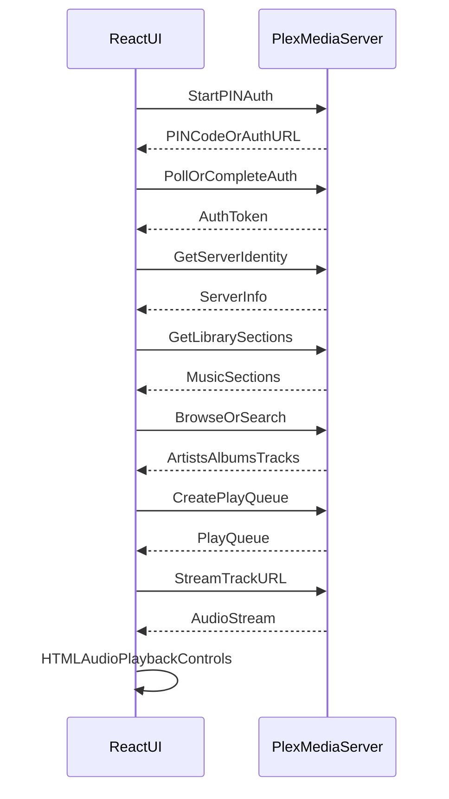

# Features — Ralphie Music (Plex)

This document defines the **initial feature set (v1)** for a **Tauri desktop app** (React frontend + shadcn UI) that connects to **Plex Media Server (PMS)** to **browse and play music**.

All Plex API references should use the official Plex PMS docs: [developer.plex.tv/pms](https://developer.plex.tv/pms/).

## MVP (v1): Connect + Play Music

### Authentication (Plex sign-in / PIN)

- Start a Plex **PIN / device sign-in** flow and obtain a user auth token.
- Store the token securely for the session (optionally persist it, depending on platform capabilities).
- Show clear auth states:
  - Signed out
  - Signing in (PIN + progress)
  - Signed in (account/server summary)
- Support sign-out (clears token + app state).

### Server selection & connection

- Configure PMS connection target:
  - Server URL (manual entry)
  - Optional: show discovered/known connections if available later
- Validate connection:
  - Fetch PMS identity/info
  - Display “Connected to {serverName}”
- Handle failures:
  - “Server unreachable” with retry
  - “Auth expired/invalid” with re-auth

### Music library discovery

- Fetch library sections and **filter to music sections**.
- Let user pick an active music library section.
- Persist the selected library section id (per server).

### Browse

- Browse hierarchy:
  - Artists → Albums → Tracks
- Track rows show:
  - Title
  - Duration
  - (If available) artist/album context
  - (If available) artwork thumbnail
- Include basic sorting controls where supported (A–Z, recently added, etc.).

### Search

- Search within the selected music library.
- Search results support:
  - Artists
  - Albums
  - Tracks
- Clicking a result navigates to the appropriate detail view and/or starts playback.

### Playback (streaming in WebView)

- Stream audio from PMS and play via **HTMLAudioElement** in the React UI.
- Player controls:
  - Play / pause
  - Next / previous (within the queue)
  - Seek (scrub bar)
  - Volume + mute
- “Now Playing” UI:
  - Artwork
  - Track title
  - Artist + album
  - Elapsed / remaining time

### Queue (basic)

- Build a playback queue from:
  - Single track
  - Album (play all tracks)
  - Artist (optional in MVP if it’s easy; otherwise defer)
- Queue actions:
  - “Play next”
  - “Add to queue”
  - Clear queue

### UX essentials

- Loading states:
  - Skeletons for lists
  - Disabled controls while fetching/connecting
- Empty states:
  - No server configured
  - No music libraries found
  - No results
- Error handling:
  - Toasts for transient errors
  - Inline banners for blocking errors

### Settings (minimal)

- Server URL / connection settings
- Sign out
- Optional toggles (only if needed for v1):
  - “Remember me on this device”

## Next (post-v1): Quality-of-life

- **Recently played / continue listening** (if accessible via PMS endpoints)
- **Playlists**: list + play, add/remove items (later)
- **Keyboard shortcuts**:
  - Space = play/pause
  - Left/right = seek
  - Up/down = volume
- **Global media keys** (OS integration; platform-dependent)
- **Offline downloads / caching** (explicitly separate from streaming; likely needs a different architecture)

## Out of scope for v1 (explicit)

- Multi-user switching / profiles
- Library management (edit metadata, rating, match/unmatch)
- Transcoding controls / advanced audio stream selection
- Lyrics, waveforms, equalizer

## API touchpoints (high-level)

All endpoints and required headers/behavior should be implemented according to the Plex PMS docs: [Plex Media Server API](https://developer.plex.tv/pms/).

- **Auth** (see “Authenticating with Plex” in the PMS docs: [Plex Media Server API](https://developer.plex.tv/pms/))
  - Obtain and use a user token.
  - Send the token on requests (commonly via `X-Plex-Token`) as described by Plex.
- **Server identity & health** (see “General” in the PMS docs: [Plex Media Server API](https://developer.plex.tv/pms/))
  - Use PMS identity/info endpoints to confirm connectivity and display server metadata.
- **Library discovery & browsing** (see “Library” in the PMS docs: [Plex Media Server API](https://developer.plex.tv/pms/))
  - Library sections: list all sections, filter to music.
  - Browse artists/albums/tracks and retrieve the metadata needed for UI lists.
- **Search** (see “Search” in the PMS docs: [Plex Media Server API](https://developer.plex.tv/pms/))
  - Search within the selected music library.
- **Play queues / playback** (see “Play Queue” + “Timeline” in the PMS docs: [Plex Media Server API](https://developer.plex.tv/pms/))
  - Create/manage a play queue for consistent next/previous behavior.
  - Obtain streamable media URLs for tracks and play via HTML audio.

## UI structure (shadcn-friendly mapping)

- **App shell**
  - Sidebar: Library picker + navigation (Browse, Search, Playlists (later), Settings)
  - Main content: list/detail views
  - Bottom: persistent “Now Playing” bar
- **Key screens**
  - Sign-in (PIN flow) dialog/screen
  - Server connect/settings screen
  - Artists list
  - Artist detail (albums)
  - Album detail (tracks)
  - Search screen (results grouped by type)
  - Settings
- **Suggested routes (React)**
  - `/signin`
  - `/settings`
  - `/library/:sectionId/artists`
  - `/library/:sectionId/artist/:ratingKey`
  - `/library/:sectionId/album/:ratingKey`
  - `/library/:sectionId/search?q=...`
- **Core UI components (suggested)**
  - `PlexSignInDialog` / `SignInScreen`
  - `ServerStatusBadge`
  - `LibraryPicker`
  - `ArtistsList`, `ArtistDetail`, `AlbumDetail`, `TrackList`
  - `SearchView`
  - `NowPlayingBar` (artwork + metadata + controls)
  - `QueueDrawer` (optional in MVP; can start as a simple panel)
- **shadcn components to lean on**
  - Navigation/layout: `Sidebar`, `Sheet`, `Separator`
  - Auth/settings: `Dialog`, `Input`, `Button`, `Switch`
  - Browse/search: `Card`, `Command`, `Select`, `Skeleton`
  - Player: `Button`, `Slider` (if/when added), `Tooltip`, `Kbd`
  - Feedback: `Sonner` (toasts), `Spinner`

## High-level data flow

## Acceptance criteria (MVP)

- User can complete Plex sign-in, connect to a PMS server, select a music library, click a track, and hear audio.
- User can pause/resume, seek, and skip within the queue.
- App surfaces clear, actionable errors when:
  - PMS is unreachable
  - Auth expires or is invalid

